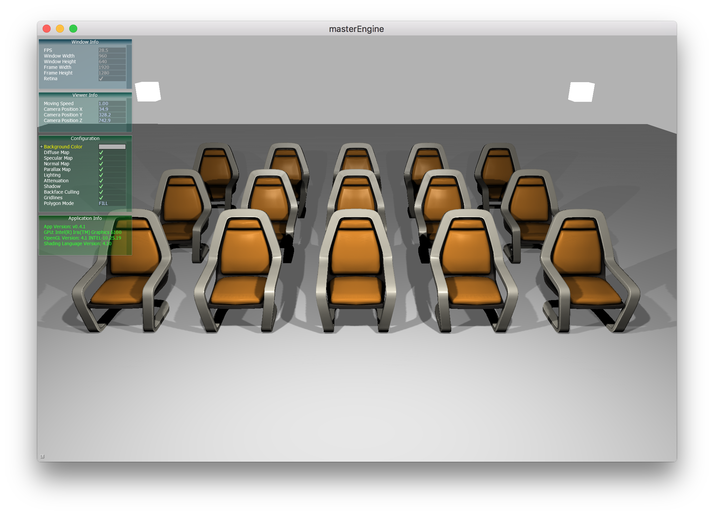
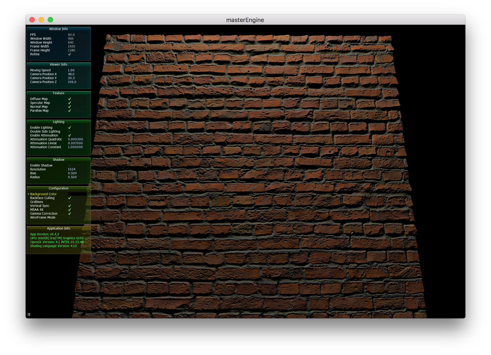

# atview

A cross-platform 3D model viewer for learning purpose, based on OpenGL, Bullet, Assimp, FreeImage, and AntTweakBar.

## Features

* Supports reading 40+ 3D file formats, including FBX, DXF, Collada, Obj, X, PLY, 3DS.
* Supports popular texture formats like PNG, BMP, JPEG, TIFF.
* Supports diffuse map, specular map and normal map.
* Supports custom skybox texture.

## Screenshots





## Usage

### Import

* In GUI, Drop files onto the window.

* In CLI, Pass path of files as arguments:

```
atview /path-to-models/rock.obj
```

### Delete

1. Select a mesh or light;
2. Press `BACKSPACE` to delete the selected item.

### Move

* Press `w` and `s` to move forward or backward
* Press `a` and `d` to move left ot right
* Press `e` and `q` to move up or down
* Click and hold your left mouse button and drag to change viewport

### Copy & Paste

1. Select a mesh or light;
2. Press `Ctrl + C` to copy the selected item;
3. Press `Ctrl + V` to paste it.

### Screenshots

Press `<F10>` to take screenshots. (BMP only)

## Build

You don't need to download any third-party libraries. I have put them together with the source code.

For macOS, clone this repository and type `make` to build.

For Windows, just download the VS2017 project from the "release" page and build it. All `*.dll` and `*.lib` are included.
