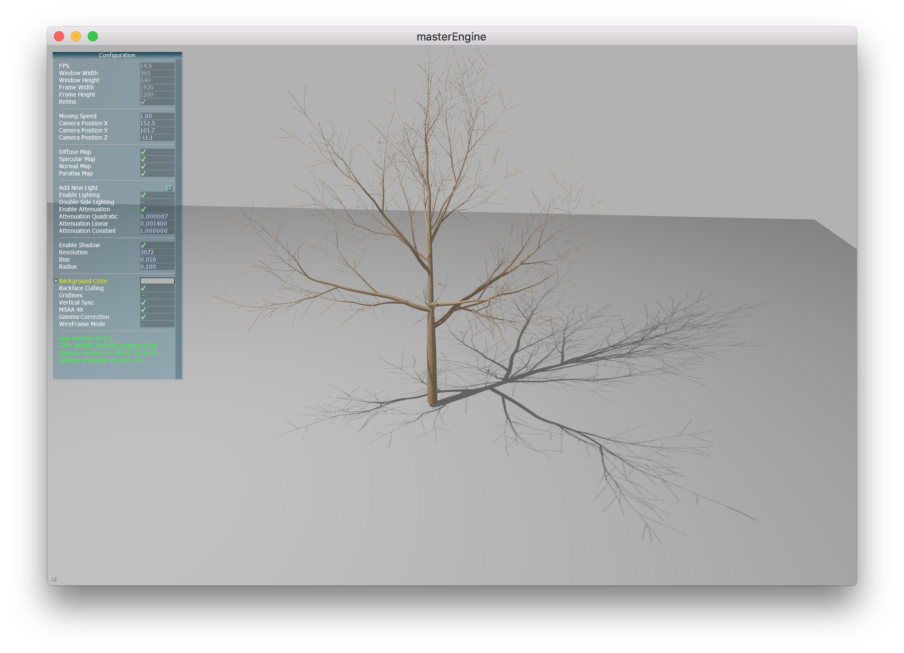
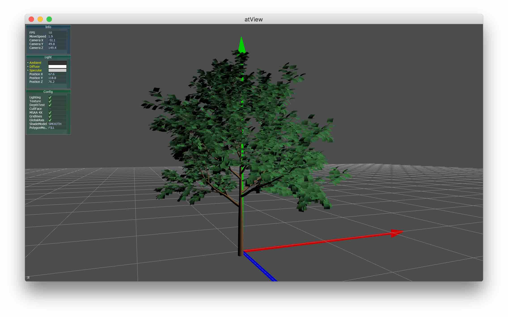
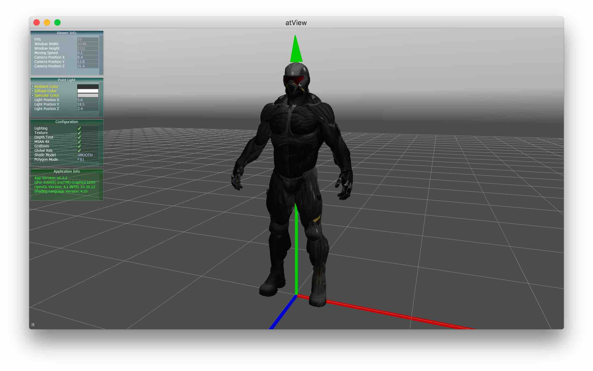
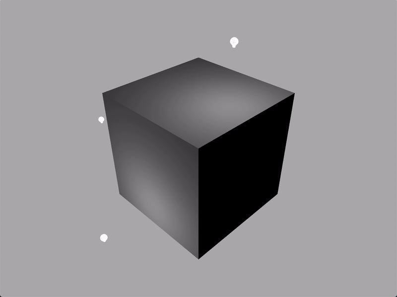

# Ash Engine

Ash Engine is a cross-platform 3D engine (only for learning purpose) based on Qt, OpenGL and Assimp.

## Screenshots

## Requirements

* Windows 7 x64 or newer, macOS 10.12 or newer, or Ubuntu 16.04
* A graphics card that supports OpenGL 3.3+

## Features

* Friendly, simple and convenient GUI.
* Readable, clear code structure which is easy to expand.
* Supports reading and saving 3D model files in 40+ formats, including FBX, DXF, Collada, Obj, X, PLY, 3DS, etc.
* Supports reading and saving the entire project (using the file type `*.aeproj` defined by this engine)
* Uses tree structure to describe the scene, supports basic transformation (translation, rotation, scaling) on model and mesh.
* Supports diffuse maps, specular maps, and normal maps.
* Supports ambient light, directional light, point light, and spotlight. You can create not more than 8 lights of each type. For each light, you can adjust its color, position, and many other properties.

## User Manual

### Basic User Manuals

The basic user manuals describe the structure and usage of Ash Engine.

[Basic User Manual (English)](doc/basic-manual-en.md)

[Basic User Manual (Chinese)](doc/basic-manual-cn.md)

### Advanced User Manuals

The advanced user manuals cover the implementation of custom functions using API provided by Ash Engine. This requires the user to be familiar with C++ object-oriented programming and some Qt classes (such as `QVector3D`).

Note: **Read the basic manuals first** before you start to read any advanced manual.

#### For English Users

[Advanced User Manual 1: Scene Structure (English)](doc/advanced-user-manual1-en.md)

[Advanced User Manual 2: Create a window (English)](doc/advanced-user-manual2-en.md)

[Advanced User Manual 3: Model Loading (English)](doc/advanced-user-manual3-en.md)

[Advanced User Manual 4: Multiple Lights (English)](doc/advanced-user-manual4-en.md)

[Advanced User Manual 5: Basic Transformation (English)](doc/advanced-user-manual5-en.md)

[Advanced User Manual 6: Custom Rendering Loop (English)](doc/advanced-user-manual6-en.md)

#### For Chinese Users

[Advanced User Manual 1: Scene Structure (Chinese)](doc/advanced-user-manual1-cn.md)

[Advanced User Manual 2: Create a window (Chinese)](doc/advanced-user-manual2-cn.md)

[Advanced User Manual 3: Model Loading (Chinese)](doc/advanced-user-manual3-cn.md)

[Advanced User Manual 4: Multiple Lights (Chinese)](doc/advanced-user-manual4-cn.md)

[Advanced User Manual 5: Basic Transformation (Chinese)](doc/advanced-user-manual5-cn.md)

[Advanced User Manual 6: Custom Rendering Loop (Chinese)](doc/advanced-user-manual6-cn.md)

## Build from source

**Note**: This project was built under Qt 5.9.7. No matter which platform or IDE you use, you must install Qt first.

Three main platforms are supported:

* Windows 7 x64 or newer
* macOS 10.14 (Older versions may work too)
* Ubuntu 16.04 LTS (Only tested on 16.04, other versions may work too)

It takes about 3 minutes to build on a laptop with Intel Core i5-5257U (single thread).

[Build Instructions (English)](doc/build-en.md)

[Build Instructions (Chinese)](doc/build-cn.md)

## Future Work

### Rendering

* DirectX 12
* Real-time shadow based on depth map
* Real-time ray tracing using DirectX 12 DXR
* Deferred rendering
* SSAO
* Displacement mapping
* PBR

### Others

* More detailed documents for both English and Chinese
* Implement unit tests using Google Test

Welcome to contact or join me!

Email: afterthat97@foxmail.com
