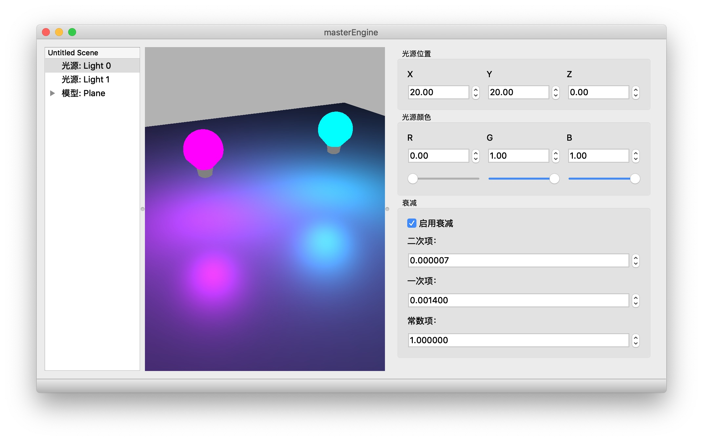

# masterEngine

A cross-platform 3D Engine for learning purpose, based on OpenGL, Bullet, Assimp, FreeImage, and AntTweakBar.

## Requirements

* macOS 10.12+ or Windows x86 / x64
* A graphics card which supports OpenGL 3.3+

> If you are using Windows, extra Visual C++ redistributable packages (VC2017 and VC2013) are required. You can download them from [this page](https://support.microsoft.com/en-us/help/2977003/the-latest-supported-visual-c-downloads).

## Features

* Supports reading 40+ 3D file formats, including FBX, DXF, Collada, Obj, X, PLY, 3DS.
* Supports diffuse map, specular map, normal map and parallax map, along with popular texture formats like PNG, BMP, JPEG, TGA.
* Supports up to 8 point lights with real-time shadow (depth map)
* Supports translation, rotation and scaling.
* Import your model easily: just drag and drop them onto the window.

## Screenshots

## Usage

### Import

How to import your models? Drag and Drop them onto the window!

### Move around

* Press `W` and `S` to move forward or backward
* Press `A` and `D` to move left ot right
* Press `E` and `Q` to move up or down
* Press `SHIFT` to shift moving speed (5X faster)
* Click and hold your left mouse button and drag to change viewport

### Transform

1. Select a mesh or light;
2. Use function keys to switch mode:
 * `<F1>` = translation (default)
 * `<F2>` = rotation
 * `<F3>` = scaling.
3. Click on the axis and drag your mouse to perform transformation.

### Add a light

**There is no light in the scene at the begining**, you need to add lights by the `Add new light` button on the left bar. You can also press `L` to add one quickly.

### Copy & Paste

1. Select a mesh or light;
2. Press `Ctrl + C` to copy the selected item;
3. Press `Ctrl + V` to paste it.

### Delete

1. Select a mesh or light;
2. Press `BACKSPACE` to delete the selected item.

### Screenshots

Press `<F10>` to take screenshots. (automatically saved as BMP on your desktop)

## Build

All the pre-compiled dependencies are placed in the `lib` directory.

For macOS, clone this repository and type `make` to build.

For Windows, just download the VS2017 project from the "release" page and build it. All the dynamic libraries and the static libraries are included.
