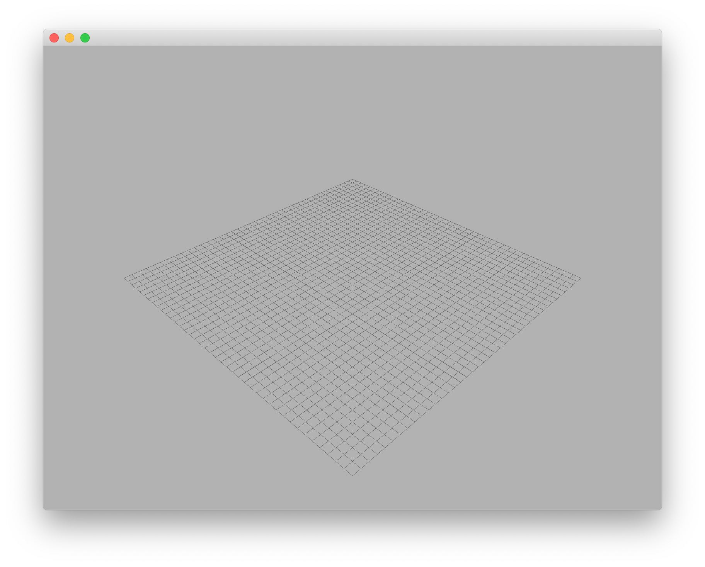

# Advanced User Manual 2: Create a window

Ash Engine has a high-level wrapper around Qt and OpenGL, and users without any OpenGL experience can easily create and render their own scenes.

## Introduction

To create a window, you need to create three classes related to OpenGL rendering:

* `OpenGLWindow`: the window used for rendering (like **drawing board**)
* `OpenGLRenderer`: the renderer of OpenGL (like **brush**)
* `OpenGLScene`: the scene for rendering

Each `OpenGLScene` instance is associated with exactly one `Scene` instance. `Scene` maintains the tree structure of the entire scene, and `OpenGLScene` is used to manage OpenGL resources. In most cases, users only need to use `Scene` to manipulate the entire scene without worrying about the workings inside `OpenGLScene`.

## Example

The following code shows how to create a window.

```cpp
int main(int argc, char *argv[]) {
    initApplication();

    QApplication a(argc, argv);

    // Step 1: Create an OpenGLWindow
    OpenGLWindow* window = new OpenGLWindow;
    window->resize(800, 600);

    // Step 2: Create an OpenGLRenderer for the window
    OpenGLRenderer* renderer = new OpenGLRenderer;
    window->setRenderer(renderer);

    // Step 3: Create a scene
    Scene* scene = new Scene;
    window->setScene(new OpenGLScene(scene));

    // Step 4: Customize your scene
    scene->addGridline(new Gridline);

    window->show();

    return a.exec();
}
```

Replace the `main` function in `src/AshEngine.cpp` with the above code, recompile and execute, you can get the following results:

