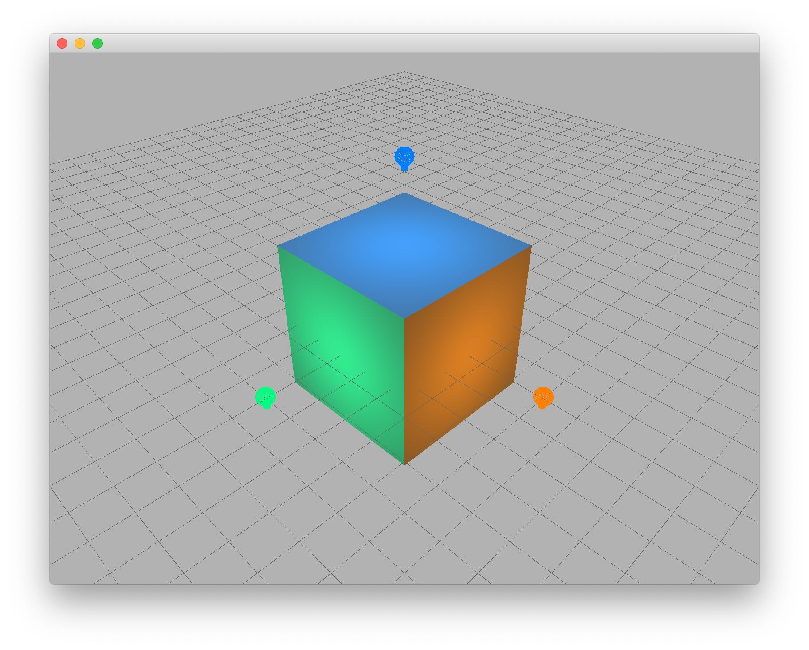

# 高级用户文档四：多光源

在前面的文档中，我们都只在场景中添加了一个平行光（否则所有的模型将是一片漆黑）。现在我们将向场景中加入更多光源。

## 光源类型

Ash Engine 支持四种光源：

| 类型 | 类名 | 属性 |
|-----|------|-----|
|环境光|`AmbientLight`|颜色、光强|
|方向光|`DirectionalLight`|颜色、光强、方向|
|点光 |`PointLight`|颜色、光强、位置、衰减|
|聚光 |`SpotLight`|颜色、光强、位置、方向、内外切角、衰减|

## 示例

下面的代码展示了如何在场景中添加多个光源，并设置它们的颜色和光强：

```cpp
int main(int argc, char *argv[]) {
    initApplication();

    QApplication a(argc, argv);

    // Step 1: Create an OpenGLWindow
    OpenGLWindow* window = new OpenGLWindow;
    window->resize(800, 600);

    // Step 2: Create an OpenGLRenderer for the window
    OpenGLRenderer* renderer = new OpenGLRenderer;
    window->setRenderer(renderer);

    // Step 3: Create a scene
    Scene* scene = new Scene;
    window->setScene(new OpenGLScene(scene));

    // Step 4: Customize your scene
    scene->addGridline(new Gridline);
    scene->camera()->moveForward(500.0f);

    Model* cubeModel = ModelLoader::loadCubeModel();
    cubeModel->setScaling(QVector3D(5, 5, 5));
    scene->addModel(cubeModel);

    DirectionalLight* directionalLight = new DirectionalLight(QVector3D(1, 1, 1), QVector3D(-2, -4, -3));
    directionalLight->setIntensity(0.6f);
    scene->addLight(directionalLight);

    PointLight* pointLight1 = new PointLight(QVector3D(1, 0.5, 0), QVector3D(5, 0, 0));
    pointLight1->setIntensity(1.2f);
    scene->addLight(pointLight1);

    PointLight* pointLight2 = new PointLight(QVector3D(0, 0.5, 1), QVector3D(0, 5, 0));
    pointLight2->setIntensity(1.2f);
    scene->addLight(pointLight2);

    PointLight* pointLight3 = new PointLight(QVector3D(0, 1, 0.5), QVector3D(0, 0, 5));
    pointLight3->setIntensity(1.2f);
    scene->addLight(pointLight3);

    window->show();

    return a.exec();
}
```

将 `src/AshEngine.cpp` 中的 `main` 函数的内容替换为以上代码，重新编译执行，你可以得到以下结果：

