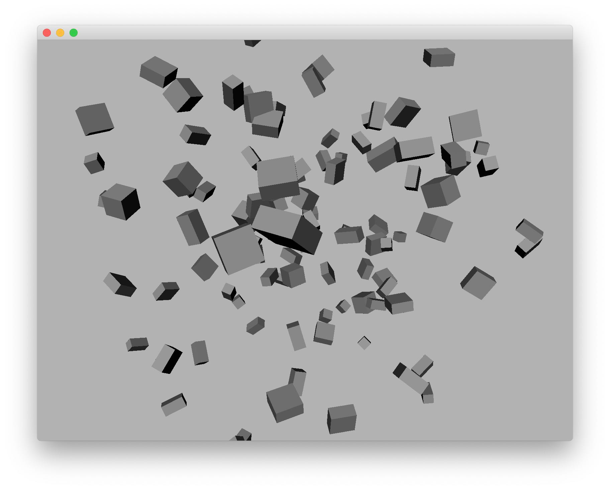

# 高级用户文档五：基本变换

## 基本变换

基本变换包括三种操作：

* 平移
* 旋转
* 缩放

在 Ash Engine 中，你可以通过模型或网格的 `translate()`, `rotate()`, `scale()` 函数来进行平移、旋转或缩放，也可以通过模型或网格的 `setPosition()`, `setRotation()`, `setScaling()` 函数直接设置其基本变换参数。

## 示例

下面的代码展示了如何在场景中添加 100 个立方体，并为它们设置随机的基本变换参数：

```cpp
int main(int argc, char *argv[]) {
    initApplication();

    QApplication a(argc, argv);

    // Step 1: Create an OpenGLWindow
    OpenGLWindow* window = new OpenGLWindow;
    window->resize(800, 600);
    window->setEnableMousePicking(false); // Disable mouse picking to improve performance

    // Step 2: Create an OpenGLRenderer for the window
    OpenGLRenderer* renderer = new OpenGLRenderer;
    window->setRenderer(renderer);

    // Step 3: Create a scene
    Scene* scene = new Scene;
    window->setScene(new OpenGLScene(scene));

    // Step 4: Customize your scene
    for (int i = 0; i < 100; i++)
        scene->addModel(ModelLoader::loadCubeModel());

    for (int i = 0; i < scene->models().size(); i++) {
        scene->models()[i]->setPosition(QVector3D(rand() % 30, rand() % 30, rand() % 30));
        scene->models()[i]->setRotation(QVector3D(rand() % 360, rand() % 360, rand() % 360));
        scene->models()[i]->setScaling(QVector3D(rand() % 2 + 1, rand() % 2 + 1, rand() % 2 + 1));
    }

    DirectionalLight* directionalLight = new DirectionalLight(QVector3D(1, 1, 1), QVector3D(-2, -4, -3));
    scene->addLight(directionalLight);

    window->show();

    return a.exec();
}
```

将 `src/AshEngine.cpp` 中的 `main` 函数的内容替换为以上代码，重新编译执行，你可以得到以下结果：

